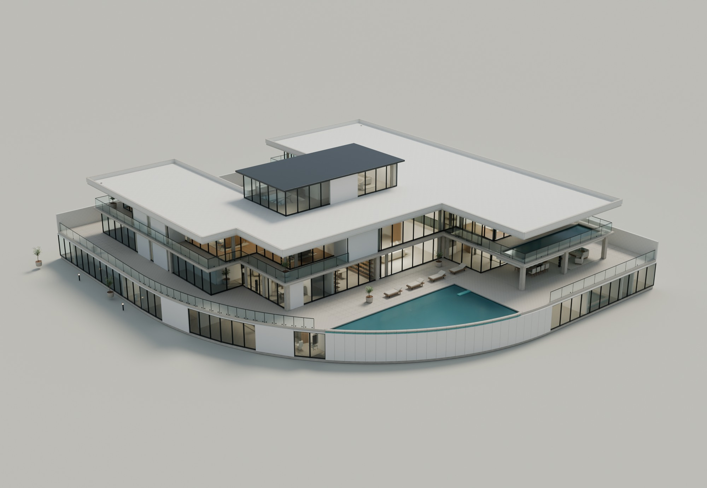

# Guanru Park · Codex × Blender 学习记录

这个仓库记录我使用 Codex 学习 Blender 的过程，也保存 Guanru Park 3.0 的完整建筑展示成果：可编辑模型、生成与导出脚本、Three.js 网页源码、材质资源、效果图和检查记录。

从询问 Blender 安装空间，到制作《失联轨道舱》，再到根据参考图重建别墅，我逐渐开始用具体画面、局部问题和版本对比来推动修改。这里既有成片，也保留了反复迭代和验证未完成的记录。

**[阅读学习过程：从安装软件到可交互建筑模型](docs/LEARNING_JOURNEY.md)** · [记录依据](docs/LEARNING_SOURCES.md)

[公开交互展示](https://guanru-park-villa.haru2248772597.chatgpt.site)



上图是 Blender 离线效果图。实际浏览器截图和性能数据位于交付目录的 `qa/` 中。

## 交付文件

| 内容 | 位置 |
|---|---|
| 3.0 可编辑模型 | [Guanru_Park_3.0.blend](guanru%20park/展示模型_3.0/Guanru_Park_3.0.blend) |
| 逐房间升级说明与测试限制 | [3.0 升级说明](guanru%20park/展示模型_3.0/3.0升级说明.md) |
| 模型重建和导出方法 | [REBUILD.md](guanru%20park/展示模型_3.0/REBUILD.md) |
| 19 张正式效果图 | [renders](guanru%20park/展示模型_3.0/renders) |
| 浏览器截图、性能数据与版本对比 | [qa](guanru%20park/展示模型_3.0/qa) |
| 网页源码及已优化的完整资源 | [guanru-park-web](guanru-park-web) |
| 2.0 模型与效果图基线 | [展示模型_2.0](guanru%20park/展示模型_2.0) |
| 3.0 升级参考 | [3.0升级参考](guanru%20park/3.0升级参考) |

下载仓库后，可直接用 Blender 打开 `.blend`。主要材质图片已打包。对比 HTML 请下载后在浏览器中打开，仓库保留了相对目录关系。

## 运行网页

需要 Node.js 22.13.0 或更新版本。

```sh
cd guanru-park-web
npm ci
npm run dev
```

生产构建：`npm run build`。页面包含楼层切换、剖切、展开、家具和屋顶显隐、室内近景、日景/傍晚及两档画质。

## 版本与检查

网页原有提交历史保留。整理 GitHub 交付时，网页从仓库根目录移至 `guanru-park-web/`，没有重写先前提交。

- `web-v2.0`：2.0 网页基线，对应提交 `64af47a84d8644818315ba29db6e3d8b772d7ad9`，当时网页位于仓库根目录。
- `web-v3.0`：已发布的 3.0 网页，对应提交 `8d933bb97204b7b1df91c0aeb7219d9c4a3400d1`，当时网页位于仓库根目录。
- `v3.0-delivery`：包含模型、网页和说明的完整 GitHub 交付。

发布前已执行网页构建、TypeScript、相关文件 lint、模型解码与交互检查，并完成本地浏览器测试。全仓库 lint 的模板既存问题及画质/性能限制详见升级说明。发布后的 55 项 HTTP 资源检查通过；线上浏览器交互与公网加载耗时因检查连接超时未完成验证。

本次 GitHub 整理不改动模型与网页行为；通过文件 SHA-256 一致性、网页资源路径、对比图片路径和上传体积检查确认交付内容完整。

## 归档范围

包含正式模型、脚本、贴图、已优化网页资产、正式效果图、检查数据和浏览器截图。依赖目录、构建缓存、日志、Blender 自动备份和重复模型副本不进入仓库。`web_export/*.glb` 是可由 Blender 重新导出的中间文件；网页运行所需的 glTF、二进制和贴图已完整放入 `guanru-park-web/public/assets-v3/`。
