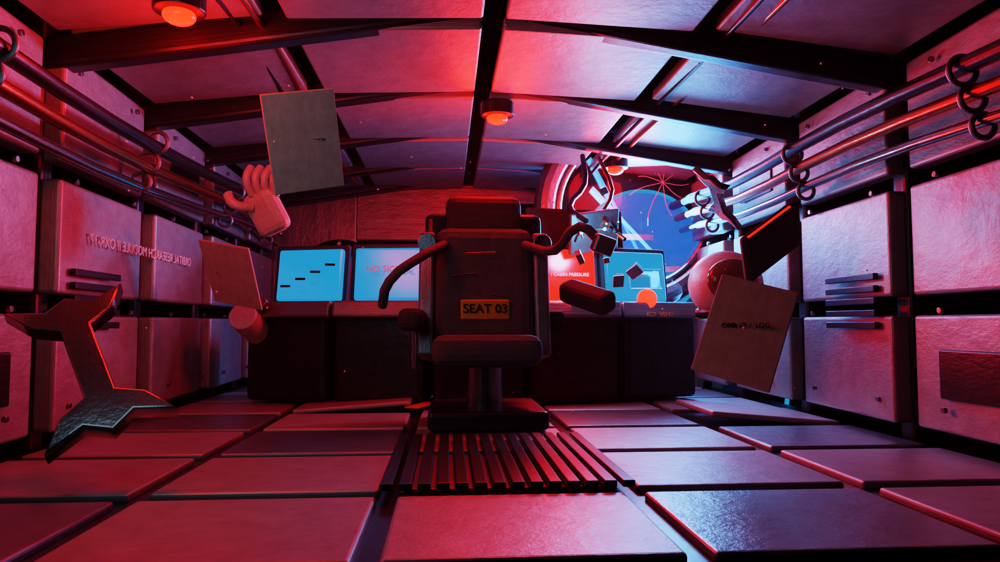
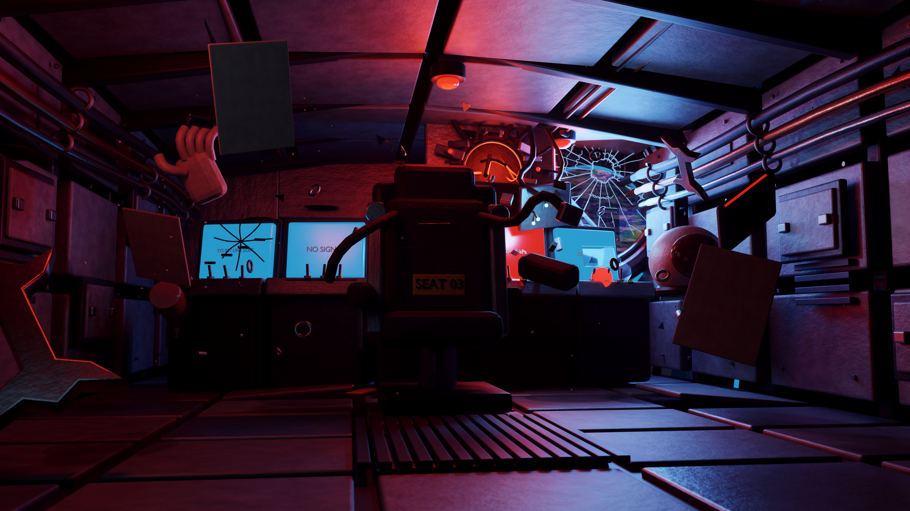
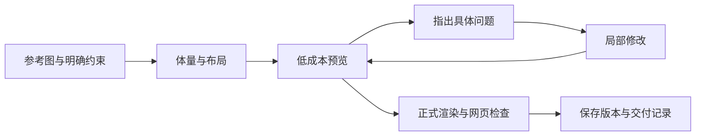

# 我用 Codex 学习 Blender：从安装软件到做出可交互的建筑模型

这份记录整理于 2026 年 9 月 9 日，依据我在 Blender 项目下的实际 Codex 对话、生成脚本、渲染图和交付记录。日期统一使用北京时间。

我最早的问题是“装一个 Blender 要多大空间？”。后来，我开始让 Codex 制作科幻舱室、修改材质和镜头，再根据建筑参考图重建 Guanru Park，并把模型放进可以切换楼层的网页。这中间有完成的作品，也有看起来不对的初稿、渲染失败、文字错位和没有完成的线上验证。

我主要负责提出目标、看图判断、指出问题和决定下一轮方向；Codex 负责大量 Python、网页代码、场景修改和检查。这份记录描述这种协作过程，不把它写成我已经独立掌握全部 Blender 手工操作的证明。

## 学习时间线

| 时间 | 我在做什么 | 留下的经验 |
|---|---|---|
| 2026-07-03 | 安装 Blender，了解 Three.js，连接 Blender MCP | 先分清建模软件、网页渲染库和连接工具的职责 |
| 2026-07-03—04 | 制作 Vite + Three.js 个人主页 | 先跑通模型加载、相机和交互，模型缺失时也要有降级显示 |
| 2026-07-12—13 | 《失联轨道舱》从初稿审阅到 Codex V1、V2、V3 | 把“更精细”变成能在画面中检查的具体修改 |
| 2026-09-06 | 回顾建模环境和长任务工作方式 | 验证连接是否真的生效，保留脚本、预览和版本记录 |
| 2026-09-07 | 检查建筑参考图，制作 Guanru Park 并升级至 2.0、3.0 | 先核对空间关系，再增加装修、家具、材质和网页画质 |
| 2026-09-09 | 整理 GitHub 仓库与学习记录 | 把成果、过程和限制放在同一个可回溯的项目中 |

## 1. 起点：先弄清楚工具各自做什么

最初我连 Three.js 是什么、需不需要安装都不清楚。安装 Blender 后，我又让 Codex 安装 Three.js，并询问能否连接 Blender 的 MCP。

这一步让我逐渐分清了三件事：Blender 中保存可编辑场景；Three.js 负责网页中的实时显示和交互；MCP 是 Codex 与正在运行的 Blender 交换指令和结果的一条通道。后来的项目也使用了后台 Python 脚本，所以“Codex 正在处理 Blender 文件”并不自动表示它正在通过 MCP 操作界面。

在《失联轨道舱》任务中，我专门问了一句：

> 等等，你连接到了blender的mcp了吗？

当时的检查区分了前面的命令行审阅和后面的实际 MCP 调用。这是一次很有用的提醒：工具已经安装、服务已经启动、当前任务真正调用成功，需要分别确认。

## 2. 先做网页：模型还没有，也可以测试展示方式

第一个网页练习是 Vite + Three.js 个人主页。我希望页面有一个居中的 3D 模型，鼠标移动时略微转动，滚动页面时相机缓慢变化，并且支持手机和中英文切换。

当时还没有正式 Blender 模型，因此约定从 `public/models/hero.glb` 加载，缺失时显示占位几何体。这让我先看到一条完整链路：资源加载、相机、交互、页面布局、移动端和构建都可以先验证。后来把建筑模型做成网页时，这段经验就用上了。

这个练习属于独立项目，本仓库只记录它在学习过程中的作用。这里的网页源码是后来的 Guanru Park 展示工程。

## 3. 《失联轨道舱》：第一次认真追着画面改

我给这个项目的目标很具体：一个事故后废弃的近地轨道科研舱，红色警报灯、蓝色地球光、半圆控制台、破损座椅 `Seat 03`、裂纹观察窗和漂浮杂物。前景是工具，中景是座椅与控制台，背景是窗外地球。

我先让另一个模型生成初稿，再让 Codex 审阅。最有价值的发现是：场景里存在很多对象，最终画面仍然可能看不清。铆钉、按钮和电缆的数量，无法替代构图、曝光和主体的可读性。我没有把当时对某个模型的尖锐评价当成通用能力排名；那只是对这一个初稿的反馈。

### V1 到 V2：把审美要求拆成问题

Codex 的第一版完成后，我仍然不满意。我指出了地球不容易辨认、烧灼或撞击痕迹不足、景深层次不清楚等问题，继续要求更接近电影 CG 的感觉。

这些意见比反复说“再精细一点”更容易落到修改上：

| 我看到的问题 | 后续具体修改 | 应该怎样看结果 |
|---|---|---|
| 看不出来是地球 | 增加海陆、云层和大气层次 | 窗外是否能辨认，而不只是一个蓝色圆面 |
| 事故痕迹不明显 | 增加破洞、翻卷金属、焦痕、断线与火花 | 损坏是否集中在有意义的位置 |
| 前中后景不清楚 | 调整低机位镜头、焦点和景深 | 工具、座椅、观察窗是否有清晰层次 |
| 材质像整片红蓝塑料 | 调整金属、粗糙度、磨损和局部光源 | 材料本身能否在灯光下被区分 |

### V2 到 V3：开始检查安装关系和几何

接着我又提出了四项要求：更现实的风格、修复错位文字、提高正式渲染规格、改善破碎玻璃。

这一轮不只是调参数。屏幕文字要跟随对应屏幕的位置和方向；破损玻璃需要厚度、缺口、裂纹和碎片；窗框还需要紧固件与密封圈。它们让我开始注意“物件怎样连接和安装”，而不仅是“画面里有没有这个物件”。

| Codex V1 | Codex V3 |
|---|---|
|  |  |
| 1920 × 1080，早期正式成片 | 3840 × 2160，后续正式成片 |

两张图均来自当时的 Blender 渲染成果，保留原图，没有为这篇记录重新生成。V3 增加了破损区域、玻璃结构和细节，但中央暗部、某些物体的块状感仍然可见。“电影级”是我提出的目标，不能仅凭命名、对象数量或 4K 分辨率就宣布已经达到。

### 长时间渲染：性能预算要用在有效的地方

当时的设备是 M4、16 GB 内存。我明确表示可以渲染久一点。V3 最后使用 Cycles、3840 × 2160、768 samples，并采用 4 × 4 分块输出。

任务中遇到了 Metal 渲染中断；当时记录将一类问题定位到体积阴影组合，另一类长帧中断归因于 watchdog。实际处理包括关闭不稳定的全舱体积雾层，以及分块渲染后拼接。这里记录的是那次设备与软件组合下的排障过程，不将它写成所有 Metal 设备的固定限制。

这让我认识到：渲染更久可以服务于采样和画面质量，但不能自动修好错位文字、缺失的事故痕迹或不合理的镜头。先用低成本预览把画面改对，再进行正式渲染，才比较有意义。

## 4. Guanru Park：从想象场景转向参考图重建

科幻舱室可以围绕故事设计，建筑项目则有更强的约束。我提供了 13 张原始参考图，但先让 Codex 检查图片、写提示词，没有立即动工。

这次需要交叉看平面、外观和剖切轴测。平面用来确定房间和交通，外观用来确定体量、退台与屋顶，剖切用来核对上下层关系。图中的红圈、选中描边和软件界面不应自动变成设计要求；隐藏了上层的截图，也不能被理解为建筑原本没有上层。

最初的要求是保留弧形基座、两翼、退台、落地窗、泳池与主要空间关系，在此基础上比参考白模更完整。缺少完整尺寸图，所以项目采用统一比例和暂定层高，并保留推定说明。我把“展示模型”与“施工级准确模型”区分开了。

### 1.0、2.0、3.0 的要求发生了什么变化

| 阶段 | 当时的重点 | 新增的检查问题 |
|---|---|---|
| 初版 | 整体体量、楼层、内部空间和适量家具 | 是否仍然是参考图中的同一栋建筑？ |
| 2.0 | 门窗、家具软装、厨卫、材质与交互展示 | 近景是否更完整？分层、剖切和昼夜切换是否可用？ |
| 3.0 | 统一现代装修、非厨房无柜、嵌入式厨电与实时画质 | 每个房间是否按要求完成？网页真正加载的资产是否也更新？ |

3.0 的需求来自我补充的 9 张参考图和六个方向：现代风格、室内装修、房间不要柜子、补全家具电器、厨房内嵌一体化、提高浏览器画质。

“不要柜子”和“厨房要橱柜”容易发生冲突，所以提示词把厨房写成唯一例外。卧室用开放小桌，衣帽间用挂衣杆，电视采用壁挂，卫浴使用有支撑的台盆；厨房则保留完整橱柜与设备舱。把例外说清楚，比让模型自行猜测更有效。

完整要求保存在 [3.0 升级提示词](../guanru%20park/3.0升级参考/3.0升级提示词.md)，完成情况见 [逐房间升级说明](../guanru%20park/展示模型_3.0/3.0升级说明.md)。

## 5. 模型能渲染，不代表网页效果已经完成

我曾问：“这个 Blender 模型可以部署成一个网页之类的吗？”这把任务从制作模型，扩展到了交付一个可操作的展示页面。

Blender 的离线效果图和浏览器中的实时画面需要分别验收。玻璃、水、阴影和室内光照在网页中需要重新处理；提高效果图质量，也不代表网页实际加载的模型和材质已经更新。

3.0 的网页采用按楼层组织的模型资源，提供 2K 高画质和 1K 标准材质，并结合主阴影、环境遮蔽和地面间接光烘焙。剖切、展开或隐藏家具时，要停用可能留下残影的烘焙效果。最后增加主客厅、主卧、中西厨和主卫等近景，是为了让细节能够被实际看到和检查。

| 2.0 实际浏览器截图 | 3.0 实际浏览器截图 |
|---|---|
|  |  |

以上是实际浏览器画面；仓库中的 `renders/` 则是 Blender 离线输出。完整五组对比保存在 [浏览器对比](../guanru%20park/展示模型_3.0/qa/浏览器对比.html) 和 [离线效果图对比](../guanru%20park/展示模型_3.0/qa/离线效果图对比.html)，下载后打开 HTML 即可查看。

在当时的 M4、16 GB、1440 × 1000 视口下，典型视角实测高画质约 24.6–52.1 FPS，标准约 41.3–60 FPS。这些数字对应特定视角和测试方法，不是所有设备的保证。测试细节见 [性能记录](../guanru%20park/展示模型_3.0/qa/performance-v3.json)。

## 6. 做完以后，还要能找到、重开和回退

过程中还有一次看似“文件消失”的问题。检查后发现是文件隐藏属性和同步产生的关联，内容并没有直接丢失。这让我开始关心作品之外的事情：原文件是否还在、是否存在完整副本、贴图有没有打包、文件夹中的版本究竟代表什么。

《失联轨道舱》上传 GitHub 后，我又问了“草稿 PR 是什么意思”，随后才让 Codex 合并。到 Guanru Park 时，交付已经包含独立的 2.0/3.0 模型、脚本、截图、说明和网页历史。

本仓库保留 `web-v2.0`、`web-v3.0` 和 `v3.0-delivery` 标签。历史网页提交中的代码位于根目录，完整交付中移到了 `guanru-park-web/`。这次整理保留了先前提交，没有用新的文件目录覆盖掉历史。

## 7. 我现在会怎样描述下一次任务

回看这些对话，我提出问题的方式从“帮我做一个”“再精细一点”，逐渐变成了“哪里不对、保留什么、允许改什么、用什么画面验收”。之后可以继续沿用这样的顺序：

我会在任务里写清：

1. **保留范围**：原模型、建筑轮廓、楼层、重要镜头和旧版文件。
2. **本轮修改**：例如只处理玻璃结构、厨房设备或暗部可读性。
3. **验收画面**：主镜头、指定近景、逐层图，以及需要时的真实浏览器截图。
4. **交付内容**：可编辑模型、生成脚本、贴图、结果图和仍未解决的问题。

这份清单是从两类项目中整理出的个人做法。它的价值在于把下一步变得具体，而不在于提示词写得足够长。

## 8. 仍然保留的限制

Guanru Park 的几何检查覆盖了指定家具类别与包围盒关系，没有做全模型精确碰撞求解；建筑尺寸也来自参考图推定。网页采用实时近似，不能等同于 Cycles 路径追踪。

3.0 发布成功后，55 项页面与资源 HTTP 检查通过，但浏览器检查连接连续超时，因此没有完成线上交互和公网首次/缓存加载耗时验证。本地浏览器测试与线上资源可访问，是两条不同的证据。这个限制保留在 [发布记录](../guanru%20park/展示模型_3.0/qa/publication-v3.json) 中，没有因为项目归档就改写成“全部通过”。

当前最值得继续积累的是看图判断、材质尺度、物体安装关系、镜头选择和可重复验证的方法。这些仍需要我持续看结果、提问题，并对最终画面作出判断。

---

[返回仓库首页](../README.md) · [记录依据与材料索引](LEARNING_SOURCES.md)
